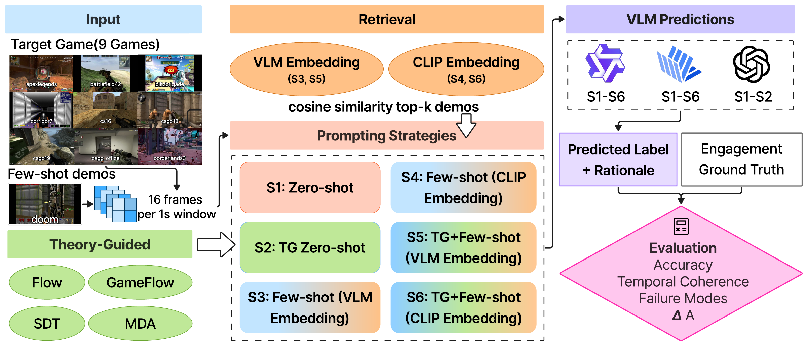

<h1 align="center">
  <strong>[EMNLP 2026 Oral] 🎮 Do Vision–Language Models Understand Human Engagement in Games?</strong>
</h1>

<p align="center">
  Ziyi Wang<sup>1,*</sup>,
  Qizan Guo<sup>2,*</sup>,
  Rishitosh Kumar Singh<sup>3,*</sup>,
  Xiyang Hu<sup>3</sup>
  <br><br>
  <sup>1</sup>Texas A&amp;M University,
  <sup>2</sup>University of Southern California,
  <sup>3</sup>Arizona State University
  <br>
  <sup>*</sup>Equal contribution
</p>

<p align="center">
  <a href="https://2026.emnlp.org/">
    
  </a>
  <a href="https://github.com/Zoewang0213/vlm-game-engagement">
    
  </a>
  <a href="https://doi.org/10.17605/OSF.IO/P4NGX">
    
  </a>
  <a href="LICENSE">
    
  </a>
</p>

<p align="center">
  
</p>

This repository studies whether **vision–language models (VLMs) can infer human engagement from gameplay video**, a latent psychological state that cannot be read directly off the screen. Using the GameVibe Few-Shot dataset across **nine first-person shooter games**, we evaluate **three VLMs** (InternVL3.5-8B-Instruct, Qwen3-VL-8B-Instruct, GPT-4o) under **six prompting strategies** on both *pointwise* engagement prediction and *pairwise* prediction of engagement change. Zero-shot predictions are generally weak and often fail to outperform per-game majority-class baselines; memory- or retrieval-augmented prompting helps pointwise prediction in some settings, while pairwise prediction stays difficult; and theory-guided prompting alone does not reliably help. Together these results point to a **perception–understanding gap**: VLMs recognize visible gameplay cues but struggle to robustly infer human engagement across games.

---

## 📑 Table of Contents

- [Overview](#-overview)
- [Main Results](#-main-results)
- [Repository Structure](#-repository-structure)
- [Dataset](#-dataset)
- [Released Predictions](#-released-predictions)
- [Confidence Intervals](#-confidence-intervals)
- [Citation](#-citation)
- [Acknowledgments](#-acknowledgments)

---

## 🔍 Overview

**Task.** Each 61-second gameplay clip is split into non-overlapping 1-second windows; after shifting the input by 1 second to account for human reaction lag, every game contributes **59 evaluation windows**. The ground truth is a binary High/Low label obtained from the trimmed mean of five observer annotation traces (`e > 0.5` is High).

- **Pointwise prediction**: predict the High/Low engagement label of each window independently.
- **Pairwise prediction**: given two consecutive windows, predict whether engagement increased or decreased (near-stable pairs with `|Δe| ≤ 0.05` are excluded).

**Prompting strategies.** Few-shot demonstrations for cross-game transfer are drawn from DOOM; no model is fine-tuned.

| ID | Strategy | Theory | Retrieval |
|:--:|:---------|:------:|:---------:|
| S1 | Zero-shot | ✗ | ✗ |
| S2 | Theory-guided (TG) zero-shot | ✓ | ✗ |
| S3 | Few-shot (VLM) | ✗ | VLM embedding |
| S4 | Few-shot (CLIP) | ✗ | CLIP embedding |
| S5 | TG few-shot (VLM) | ✓ | VLM embedding |
| S6 | TG few-shot (CLIP) | ✓ | CLIP embedding |

The theory-guided prompt operationalizes four engagement frameworks, **Flow**, **GameFlow**, **Self-Determination Theory (SDT)**, and **MDA**, into concrete visual indicators such as health bars, score displays, teammate visibility, and visual effects.

---

## 📊 Main Results

Accuracy (%) averaged over the nine games. **M** is the per-game majority-class baseline. GPT-4o is evaluated on S1 and S2 only.

**Pointwise engagement prediction** (M = 67.2)

| Model | S1 | S2 | S3 | S4 | S5 | S6 |
|:------|:--:|:--:|:--:|:--:|:--:|:--:|
| InternVL3.5-8B-Instruct | 56.9 | 52.9 | 71.3 | 56.9 | 68.3 | 51.4 |
| Qwen3-VL-8B-Instruct | 56.7 | 53.1 | 75.0 | 67.8 | 74.1 | 69.7 |
| GPT-4o | 56.6 | 56.6 | – | – | – | – |

**Pairwise prediction of engagement change** (M = 56.5)

| Model | S1 | S2 | S3 | S4 | S5 | S6 |
|:------|:--:|:--:|:--:|:--:|:--:|:--:|
| InternVL3.5-8B-Instruct | 53.1 | 49.8 | 51.8 | 53.1 | 55.9 | 49.8 |
| Qwen3-VL-8B-Instruct | 54.7 | 54.0 | 47.7 | 52.1 | 58.8 | 54.9 |
| GPT-4o | 51.9 | 54.6 | – | – | – | – |

In the pointwise setting, S3 and S5 are evaluated on the ≈18-window held-out split of each game and all other strategies on all 59 windows; they retrieve from an in-game, error-driven case base and should be read as memory-based corrective adaptation rather than strict held-out generalization. Pairwise sample sizes range from 37 to 78 pairs per game. Per-game numbers and 95% confidence intervals are in the paper (Tables 4 and 5, Appendix E).

---

## 📁 Repository Structure

```
vlm-game-engagement/
├── assets/                    # figures used in this README
├── prompts/                   # full prompt templates, verbatim from Appendices G and H
│   ├── zero_shot_prompt.txt       # zero-shot strategy (S1)
│   └── theory_guided_prompt.txt   # theory-guided strategy (S2, also used in S5/S6)
├── results/                   # released per-window predictions (S1 and S2)
│   ├── internvl3/{zeroshot,theory_zeroshot}/
│   └── qwen3vl/{zeroshot,theory_zeroshot}/
└── analysis/
    ├── compute_cis.py             # bootstrap CIs and subsampling analysis (Appendix E)
    └── ci_results.json
```

---

## 📦 Dataset

We use the public [GameVibe](https://doi.org/10.17605/OSF.IO/P4NGX) corpus (Barthet et al., 2024). Please obtain it from the original authors' release; **this repository does not redistribute the dataset or its annotations.**

The nine evaluation games are Apex Legends, Battlefield 42, Blitz Brigade, Borderlands 3, Corridor 7, CS 1.6, CSGO18, CSGO19, and CS:GO Office, with DOOM as the source domain for few-shot demonstrations.

---

## 📈 Released Predictions

`results/` holds the per-window predictions behind the S1 and S2 columns of Table 4, for both open-source models and all nine games (59 windows per game, 36 CSV files).

```
results/{internvl3,qwen3vl}/{zeroshot,theory_zeroshot}/{game}_predictions.csv
```

`internvl3` is InternVL3.5-8B-Instruct and `qwen3vl` is Qwen3-VL-8B-Instruct; `zeroshot` is S1 and `theory_zeroshot` is S2.

| Column | Description |
|:-------|:------------|
| `frame` | Window identifier, e.g. `frame00-01_01` |
| `score` | Engagement score in `[0, 1]` parsed from the model response |
| `prediction`, `pred_01` | Predicted label (`high` / `low`) and its 0/1 encoding |
| `ground_truth`, `gt_01` | Human label (`high` / `low`) and its 0/1 encoding |
| `rationale` | One-sentence rationale (`theory_zeroshot` only) |
| `raw_response` | Model response, truncated to 500 characters |

---

## 🧪 Confidence Intervals

`analysis/compute_cis.py` reproduces the bootstrap 95% confidence intervals and the 18-window subsampling analysis reported in Appendix E. It uses only the Python standard library (seed 42, 10,000 resamples) and reads the released predictions in `results/`:

```bash
python3 analysis/compute_cis.py
```

The output is written to `analysis/ci_results.json`.

---

## 📄 Citation

If you find this work useful, please consider citing:

```bibtex
@inproceedings{wang2026engagement,
  title     = {Do Vision--Language Models Understand Human Engagement in Games?},
  author    = {Wang, Ziyi and Guo, Qizan and Singh, Rishitosh Kumar and Hu, Xiyang},
  booktitle = {Proceedings of the 2026 Conference on Empirical Methods in Natural Language Processing (EMNLP)},
  year      = {2026}
}
```

---

## 🤝 Acknowledgments

This work builds on the [GameVibe](https://doi.org/10.17605/OSF.IO/P4NGX) corpus; we thank its authors for releasing the data and annotations. The authors acknowledge Research Computing at Arizona State University for providing GPU computing resources that have contributed to the research results reported within this paper.

This repository is released under the [MIT License](LICENSE).
